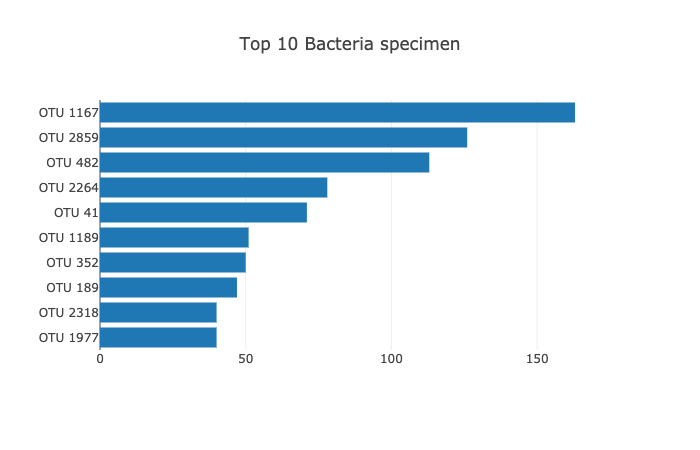
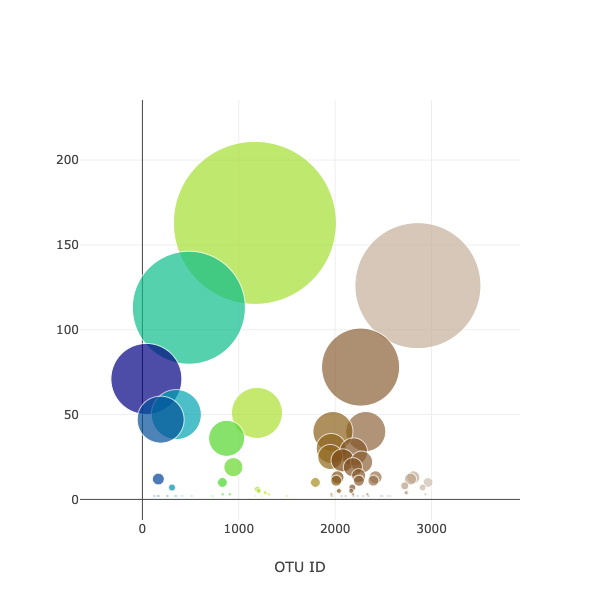
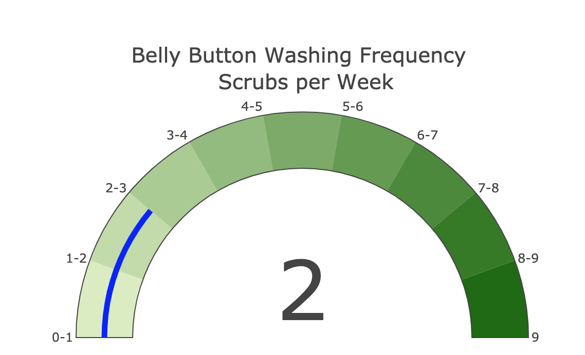

# amuthusa.bellybutton-biodiversity.github.io

## Challenge:
    
   Improbable beef is trying to generate synthetic beef by using bacteria from human naval. To do this Roza has collected list of volunteers with additional meta data and bacteria data from the naval(belly button). We would like develop charts to present the data so that Improbable beef could select the volunteer based on bacteria and its count for their next synthentic beef manafacturing.
   
### Technology Used:

   1. HTML
   2. Javascript
   3. d3 JS
   4. Plotly JS (for charts)

### Overview:

  Inorder to make the selection of bacteria and volunteer we started with top 10 bacteria specimen for each volunteer. On selecting the volunteer not only the selected volunteers metadata is displayed but also we display the Top 10 bacteria specimen and their details. 

  Next chart is to show all the bacteria present in each individual Naval using bubble chart, the bubble size is relative to the count of the bacteria present. This would give a birds eye view of count of bacteria present and which one to pick for synthetic beef based on the available quantity. 
  
  Last chart is gauge chart to show the frequency of belly button wash for each individual volunteer based on the selected volunteer 
  
### Website: https://amuthusa.github.io/bellybutton-biodiversity
